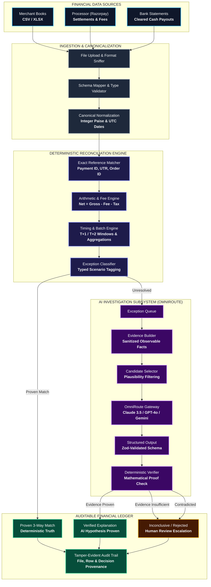
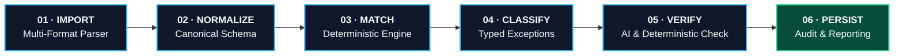
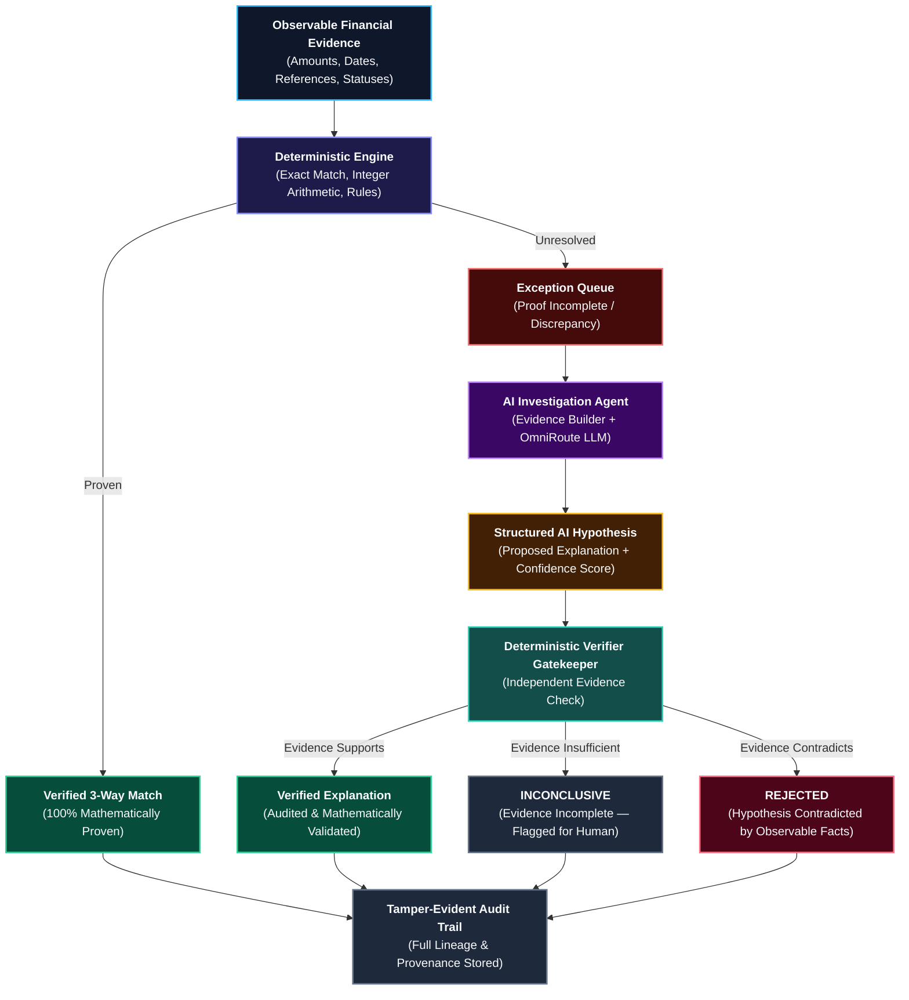

<div align="center">
  <svg xmlns="http://www.w3.org/2000/svg" viewBox="0 0 120 120" width="140" height="140" style="background: #ffffff; border-radius: 24px; padding: 8px; box-shadow: 0 8px 30px rgba(0,0,0,0.15); margin-bottom: 16px;">
  <rect width="120" height="120" rx="20" fill="#ffffff" />
  <path d="M 30 20 H 36 V 86 H 68 V 92 H 30 Z" fill="#1a3250" />
  <path d="M 44 26 H 50 V 62 H 44 Z" fill="#1a3250" />
  <path d="M 30 88 L 44 102 H 50 L 36 88 Z" fill="#1a3250" />
  <path d="M 52 20 H 74 V 44 H 68 V 26 H 52 Z" fill="#697a8d" />
  <rect x="52" y="32" width="14" height="4" fill="#697a8d" />
  <rect x="52" y="40" width="8" height="4" fill="#697a8d" />
  <path d="M 52 48 H 58 V 56 H 64 V 62 H 52 Z" fill="#697a8d" />
  <rect x="44" y="60" width="12" height="4" fill="#697a8d" />
  <rect x="84" y="60" width="12" height="4" fill="#697a8d" />
  <rect x="68" y="80" width="4" height="12" fill="#697a8d" />
  <path d="M 80 40 H 92 V 52 H 86 V 46 H 80 Z" fill="#697a8d" />
  <path d="M 80 74 H 86 V 82 H 92 V 88 H 80 Z" fill="#697a8d" />
  <path d="M 44 94 H 82 L 88 84 H 94 L 86 102 H 44 Z" fill="#697a8d" />
  <circle cx="70" cy="62" r="16" fill="none" stroke="#697a8d" stroke-width="4.5" />
  <path d="M 64 54 A 8 8 0 0 1 76 60" fill="none" stroke="#697a8d" stroke-width="2.5" stroke-linecap="round" />
  </svg>

  # LedgerLens
  
  ### Autonomous AI Finance Controller for Deterministic Three-Way Reconciliation

  <p align="center">
    <em>"Match what can be proven. Investigate what cannot. Never guess."</em>
  </p>

  <p align="center">
    <a href="https://github.com/amitwaghmare888/LedgerLens"></a>
    <a href="#benchmark-evaluation"></a>
    <a href="#benchmark-evaluation"></a>
    <a href="#test-suite"></a>
  </p>

  <p align="center">
    
    
    
    
    
    
    
  </p>

  <p align="center">
    <a href="#executive-summary"><b>Overview</b></a> &bull;
    <a href="#the-problem-why-naive-ai-fails"><b>The Core Dilemma</b></a> &bull;
    <a href="#the-ledgerlens-solution"><b>Solution</b></a> &bull;
    <a href="#system-architecture"><b>Architecture</b></a> &bull;
    <a href="#ai-safety-guardrail"><b>AI Safety Boundary</b></a> &bull;
    <a href="#benchmark-evaluation"><b>Benchmark Evaluation</b></a> &bull;
    <a href="#quick-start"><b>Quick Start</b></a> &bull;
    <a href="#api-reference"><b>API Docs</b></a> &bull;
    <a href="#security--financial-integrity"><b>Security & Integrity</b></a>
  </p>

</div>

---

## Executive Summary

**LedgerLens** is an **AI Finance Controller** engineered to eliminate the trust, accuracy, and verification breakdown in enterprise financial reconciliation. Developed for **Razorpay AI Buildathon 2026 (Track 04: AI Finance Controller)**, LedgerLens solves financial reconciliation by strictly segregating **deterministic mathematical proof** from **AI hypothesis generation**.

Traditional reconciliation systems either rely on manual review or delegate decision-making to probabilistic LLMs that hallucinate matches across similar reference identifiers, identical payment amounts, and settlement timing gaps. **LedgerLens inverts this model:**

| 100.0% Precision | Zero False Matches | +17 Over Baseline | Three-Way Evidence |
| :---: | :---: | :---: | :---: |
| Flawless accuracy across all 75 benchmark edge cases | 0 false matches against adversarial similarity traps | 86.7% match rate vs 82.7% traditional exact match | Proven across Merchant Books, Razorpay, and Bank Statements |

> ### The LedgerLens Verification Doctrine
> **Financial reconciliation is an evidence and provenance problem, not a text-generation problem.**  
> *The AI can investigate an ambiguous exception. It cannot manufacture financial truth.*

---

## The Problem: Why Naive AI Fails

Modern finance operations reconcile transactions across three disparate sources:
1. **Merchant Books** &mdash; Internal order management records, sales ledgers, customer refunds, and adjustments.
2. **Payment Processor (Razorpay)** &mdash; Captured payments, Merchant Discount Rate (MDR) deductions, 18% GST deductions, and payout batches.
3. **Bank Statements** &mdash; Cleared cash receipts, settlement timing delays (T+1 / T+2), and consolidated deposits.

### The Verification Trap

A single transaction rarely appears identical across all three books. Fee subtractions, tax withholdings, timing delays, and batching introduce non-trivial variance.

When generic LLMs or probabilistic similarity algorithms are applied to financial ledgers, catastrophic errors occur:

```text
  ADVERSARIAL SIMILARITY TRAP (Empirical Failure Case)
  
  Merchant Record:     ORDER_10492 | INR 10,000.00 | 14:02:11 | Customer A
  Processor Record:    ORDER_10493 | INR 10,000.00 | 14:05:40 | Customer B
  
  [FAIL] Naive AI / Fuzzy Matcher:
         "99% Similarity Match: Identical amount, sequential order IDs, 3-minute gap."
         -> CATASTROPHIC FALSE MATCH (Silent Ledger Drift & Compliance Violation)
  
  [PASS] LedgerLens Deterministic Controller:
         "External references do not match. 3-way identity proof incomplete.
          No arithmetic link connecting Customer A to Payment B."
         -> ISOLATED TO EXCEPTION QUEUE (Zero False Positives Guaranteed)
```

### Deterministic Architecture vs. Probabilistic LLM Matching

| Capability | Naive AI / Fuzzy Matchers | LedgerLens Finance Controller |
| :--- | :--- | :--- |
| **Primary Join Authority** | Probabilistic vector or text similarity | **Strict Deterministic Rules & Cryptographic Proof** |
| **Monetary Arithmetic** | Floating-point or LLM token guessing | **Integer-Paise Arithmetic (INR 1.00 = 100 paise)** |
| **Fee & Tax Deductions** | Overlooked or approximated | **Explicit Razorpay MDR & 18% GST Decomposition** |
| **Ambiguous Discrepancies** | Forced match to maximize completion rate | **Isolated to Exposure-Weighted Exception Queue** |
| **Role of Generative AI** | Autonomous decision maker | **Bounded investigator proposing hypotheses only** |
| **AI Output Verification** | Unverified acceptance | **Subjected to Deterministic Verifier Gatekeeper** |
| **Audit Provenance** | Lost in latent model weights | **Immutable File, Row Index, and Timestamp Provenance** |

---

## The LedgerLens Solution

LedgerLens operates on a dual-engine architecture:

1. **Deterministic Execution Engine (Final Authority):**
   - Ingests and normalizes heterogeneous source files (CSV, XLSX) into a canonical financial schema.
   - Enforces 3-way correlation: Merchant $\cap$ Razorpay $\cap$ Bank.
   - Calculates exact integer-paise arithmetic accounting for fees, taxes, refunds, and batch settlements.
   - Validates proof before any transaction state transitions to `MATCHED`.

2. **AI Investigation Subsystem (Hypothesis Engine):**
   - Activates exclusively when deterministic logic isolates an unresolved exception.
   - **Evidence Builder** extracts observable facts (amounts, timestamps, reference substrings, statuses) with all ground-truth metadata stripped.
   - **Candidate Selector** identifies plausible related transaction clusters based on temporal and arithmetic windows.
   - **OmniRoute** queries frontier models (Claude 3.5 Sonnet, GPT-4o, Gemini 1.5 Pro) for contextual root-cause reasoning.
   - **Deterministic Verifier** checks whether the AI hypothesis is mathematically and temporally consistent with observable evidence before recording a `VERIFIED_EXPLANATION`.

---

## System Architecture



---

## Six-Stage Reconciliation Pipeline



| Stage | Name | Description | Guarantees |
| :---: | :--- | :--- | :--- |
| **01** | **Import** | Ingests CSV or XLSX files from Merchant, Razorpay, and Bank statements. | Format auto-detection, macro isolation, file size safety checks. |
| **02** | **Normalize** | Maps heterogeneous source columns into canonical schema representation. | Currency standardized to integer paise (INR), timestamps to UTC ISO-8601. |
| **03** | **Match** | Executes exact matching, fee/tax deductions, settlement timing, and batch joins. | 3-way correlation required for full match; zero floating-point drift. |
| **04** | **Classify** | Categorizes un-reconciled items into 9 explicit exception scenarios. | Exposes financial impact (`exposurePaise`) for priority resolution. |
| **05** | **Verify** | Runs AI investigation through OmniRoute with strict verifier validation. | Proposes root cause; verifier confirms facts or rejects conjecture. |
| **06** | **Persist** | Records matches, verified explanations, exceptions, and audit logs. | Complete lineage from source filename + row index to final disposition. |

---

## AI Safety Guardrail

The defining architectural pillar of LedgerLens is its **Zero-Trust AI Guardrail**. The model is treated as an untrusted investigator whose output must be independently proven.



### The Three Verifier Outcomes

1. **Verified Explanation (`verified`)**: The AI proposed that an INR 80 missing difference between Razorpay and Bank was a standard 2% MDR fee on an INR 4,000 transaction. The Deterministic Verifier calculated `400000 * 0.02 = 8000 paise` and confirmed the exact match.
2. **Rejected (`rejected`)**: The AI claimed two records were related, but the verifier detected that the transaction timestamps were 14 days apart&mdash;violating the maximum allowable T+2 settlement window. The claim is discarded.
3. **Inconclusive (`inconclusive`)**: The Merchant and Razorpay records match, but the Bank statement has no corresponding deposit. The AI conjectures that the bank statement is delayed. Because no proof exists in cleared funds, LedgerLens refuses to finalize the match.

---

<div id="benchmark-evaluation"></div>

## Benchmark Evaluation

LedgerLens was evaluated against an exhaustive synthetic benchmark comprising **75 test cases** and **292 source records**, incorporating realistic noise, real-world Razorpay fee structures, timing windows, batched payouts, and adversarial traps.

### Benchmark Scorecard

| Metric | Benchmark Result | Baseline (Exact Match) | Delta / Impact |
| :--- | :---: | :---: | :---: |
| **Total Test Cases** | **75** | 75 | &mdash; |
| **Total Source Records** | **292** | 292 | &mdash; |
| **Correct Decisions** | **75 / 75** | 58 / 75 | **+17 Correct Decisions** |
| **Precision** | **100.0%** | 85.5% | **+14.5% Precision** |
| **Recall** | **100.0%** | 82.7% | **+17.3% Recall** |
| **Match Rate** | **86.7%** | 82.7% | **+4.0% Provable Matches** |
| **False Matches (False Positives)** | **0** | 0 | **Zero Errors** |
| **Adversarial Trap False Matches** | **0 / 5** | 0 / 5 | **100% Trap Immunity** |
| **Unsafe Matches** | **0** | 0 | **100% Safe** |
| **Unresolved Cases Safely Isolated** | **10** | 17 | **Intelligently Dispositioned** |

### Scenario Breakdown (100% Success Across All 9 Categories)

```text
  Clean Three-Way Match     [=========================] 25 / 25  (100%)
  Fee / Tax Deductions      [==========]                10 / 10  (100%)
  Timing Windows (T+1/T+2)  [========]                  8 / 8   (100%)
  Refunds & Reversals       [========]                  8 / 8   (100%)
  Adjustments & Chargebacks [=====]                     5 / 5   (100%)
  Batched Settlements       [====]                      4 / 4   (100%)
  Missing Merchant Record   [=====]                     5 / 5   (100%)
  Missing Bank Record       [=====]                     5 / 5   (100%)
  Adversarial Traps         [=====]                     5 / 5   (100%)
```

---

## Core Capabilities & Domain Logic

### 1. Integer-Paise Precision
Floating-point mathematics in standard JavaScript (`0.1 + 0.2 === 0.30000000000000004`) causes rounding errors that corrupt financial ledgers. LedgerLens stores all currency as **integer paise** (INR 1.00 = `100` paise). All fee, tax, and settlement equations are strictly evaluated with integer arithmetic.

### 2. Automated Fee & Tax Decomposition
Payment processors deduct Merchant Discount Rates (MDR) and statutory taxes before settling funds into merchant bank accounts. LedgerLens natively models:
$$\text{Bank Settlement} = \text{Gross Amount} - \text{MDR Fee} - \text{GST (18\%)}$$

### 3. Settlement Timing Windows
Bank transfers do not occur instantaneously. LedgerLens accommodates configurable settlement horizons:
- **Same Day (T+0)**: Instant IMPS / UPI settlements.
- **Next Day (T+1)**: Standard NEFT / RTGS settlement runs.
- **Two Days (T+2)**: Weekend or holiday bank batch payouts.

### 4. Consolidated Batch Settlements
A single bank deposit entry often represents the net payout of dozens of individual customer transactions minus processor fees. LedgerLens supports many-to-one deterministic aggregation, linking individual order line items to single lump-sum bank deposits.

### 5. Multi-Model AI Gateway (OmniRoute)
LedgerLens connects to frontier AI models through an extensible adapter pattern:
- **Anthropic Claude 3.5 Sonnet** (High-precision financial reasoning)
- **OpenAI GPT-4o** (Multi-step logic and scenario hypothesis)
- **Google Gemini 1.5 Pro / Flash** (Large context exception correlation)
- **Groq Llama-3** (Ultra-low-latency investigation runs)

---

## User Interface & Experience

The LedgerLens application provides an intuitive, high-performance financial command center:

```text
+--------------------------------------------------------------------------+
|  LedgerLens | AI Finance Controller               [Amit Waghmare] [Sign Out]
+--------------------------------------------------------------------------+
|  [Overview]    [Import & Normalize]    [Reconcile]    [Exceptions (10)]   |
+--------------------------------------------------------------------------+
|                                                                          |
|   RECONCILIATION SUMMARY RUN #292                                        |
|   +-------------------+-------------------+-------------------+          |
|   |  TOTAL RECORDS    |  MATCHED (86.7%)  |  EXCEPTIONS       |          |
|   |  292              |  245 Proven       |  10 Isolated      |          |
|   +-------------------+-------------------+-------------------+          |
|                                                                          |
|   PRIORITY EXCEPTION QUEUE                                               |
|   +--------------+------------------+-------------+--------------------+ |
|   | Scenario     | Reference        | Exposure    | Action             | |
|   +--------------+------------------+-------------+--------------------+ |
|   | FEE_MISMATCH | PAY_99201        | INR 80.00   | [Investigate (AI)] | |
|   | TIMING_GAP   | ORD_10482        | INR 12,500  | [Investigate (AI)] | |
|   | MISSING_BANK | ORD_10920        | INR 4,200   | [Review Facts]     | |
|   +--------------+------------------+-------------+--------------------+ |
|                                                                          |
+--------------------------------------------------------------------------+
```

1. **Ingestion Studio**: Drag-and-drop file upload for Merchant, Razorpay, and Bank CSVs/XLSX files with live format detection and schema mapping.
2. **Reconciliation Control Center**: One-click execution triggering the 6-stage deterministic pipeline with live stage progress tracking.
3. **Exception Queue & Priority Matrix**: Exposure-weighted queue sorting unresolved cases by monetary risk so controllers tackle large amounts first.
4. **Interactive AI Investigation Modal**: Explains root cause hypotheses, shows raw evidence packets, and presents the deterministic verifier's judgment.
5. **Audit Trail & Lineage**: Full chronological log recording user actions, timestamps, and row-level file provenance.

---

## Quick Start

### Prerequisites
- **Node.js**: v20.x or higher
- **npm**: v10.x or higher
- **Git**

### 1. Clone & Install
```bash
# Clone the repository
git clone https://github.com/amitwaghmare888/LedgerLens.git
cd LedgerLens/ledgerlens

# Install dependencies
npm install
```

### 2. Configure Environment
Copy `.env.example` to `.env.local`:
```bash
cp .env.example .env.local
```

Configure parameters (default values work out of the box for local SQLite):
```env
# Database Configuration
LEDGERLENS_DB_PATH="./data/ledgerlens.db"
LEDGERLENS_DB_DRIVER="sqlite"

# Optional AI Investigation (OmniRoute / OpenAI / Anthropic / Gemini / Groq)
AI_PROVIDER="gemini"
AI_MODEL="gemini-1.5-flash"
AI_API_KEY="your-api-key-here"

# Optional Firebase Authentication (Pre-configured for local testing)
NEXT_PUBLIC_FIREBASE_API_KEY="AIzaSyDummyKeyForLocalTesting"
NEXT_PUBLIC_FIREBASE_AUTH_DOMAIN="ledgerlens-demo.firebaseapp.com"
NEXT_PUBLIC_FIREBASE_PROJECT_ID="ledgerlens-demo"
```

### 3. Seed Benchmark Data
```bash
# Seed 75 benchmark cases (292 records) across 9 reconciliation scenarios
npm run seed
```

### 4. Run Development Server
```bash
npm run dev
```

Open [http://localhost:3000](http://localhost:3000) in your browser.

---

<div id="test-suite"></div>

## Test Suite & Validation

LedgerLens maintains an automated test suite with **223 tests** covering all domain logic:

```bash
# Run all tests once
npm test

# Run tests in interactive watch mode
npm run test:watch

# Run code linter
npm run lint

# Build production bundle
npm run build
```

### Test Coverage Summary

```text
  Test Files  14 passed (14)
       Tests  223 passed (223)
    Duration  ~1.8s
```

- **Reconciliation Engine**: 3-way matching rules, timing windows, fee deduction arithmetic.
- **Import & Ingestion Pipeline**: CSV/XLSX parsing, format sniffing, data sanitization, schema validation.
- **Exception Classifier**: Precise scenario categorization, zero-difference edge case checks.
- **AI Investigation & Verifier**: Evidence extraction, prompt generation, mathematical proof verification, trap resistance.
- **Data Repositories**: CRUD operations, run filtering, pagination, search.
- **API Endpoints**: Input payload validation with Zod, status code assertions.

---

## API Reference

### 1. Ingest Data Source
`POST /api/import`

Upload and validate raw financial files.

**Request (Multipart Form Data):**
- `file`: CSV or XLSX file
- `source`: `"merchant"` | `"razorpay"` | `"bank"`
- `format`: `"csv"` | `"xlsx"`
- `confirmImport`: `"true"` (persists records) | `"false"` (validation preview)

**Response (`200 OK`):**
```json
{
  "importId": "imp_98a72b1c",
  "source": "razorpay",
  "filename": "razorpay_settlements_dec2024.csv",
  "format": "csv",
  "totalRows": 100,
  "validRows": 98,
  "invalidRows": 2,
  "warnings": ["Row 42: Missing optional UTR reference"],
  "confirmed": true
}
```

---

### 2. Execute Reconciliation
`POST /api/recon/run`

Triggers the 6-stage deterministic reconciliation pipeline across all staged source records.

**Response (`200 OK`):**
```json
{
  "runId": "run_8f43a91e",
  "totalRecords": 292,
  "matchedCount": 245,
  "explainedCount": 5,
  "exceptionCount": 42,
  "durationMs": 1420
}
```

---

### 3. List Exceptions
`GET /api/exceptions`

Retrieves the centralized queue of unresolved financial discrepancies.

**Query Parameters:**
- `scenario` (optional): Filter by scenario (e.g. `AMOUNT_MISMATCH`, `TIMING_GAP`)
- `minAmount` / `maxAmount` (optional): Filter by exposure in paise

**Response (`200 OK`):**
```json
{
  "exceptions": [
    {
      "id": "exc_01j7k9",
      "scenario": "FEE_MISMATCH",
      "exposurePaise": 8000,
      "recordCount": 2,
      "createdAt": "2024-12-01T12:00:00Z"
    }
  ]
}
```

---

### 4. Run AI Investigation
`POST /api/exceptions/[id]`

Invokes the AI Evidence Builder, queries OmniRoute, and submits the hypothesis to the Deterministic Verifier.

**Response (`200 OK`):**
```json
{
  "investigationId": "inv_43a291",
  "exceptionId": "exc_01j7k9",
  "status": "verified",
  "hypothesis": "The difference of INR 80 represents a 2% Razorpay MDR fee applied to Order ORD_10492.",
  "reasoning": "Merchant gross amount was INR 4,000. Bank settlement was INR 3,920. 2% MDR fee equals exactly INR 80 with no timing gap.",
  "confidence": 0.98,
  "verifierStatus": "verified"
}
```

---

### 5. Audit Log Inspection
`GET /api/audit`

Fetches immutable audit logs with filterable actions and timestamps.

**Response (`200 OK`):**
```json
{
  "events": [
    {
      "id": "aud_01j9a",
      "action": "reconciliation_run",
      "userId": "usr_controller_1",
      "timestamp": "2024-12-01T12:01:00Z",
      "metadata": { "runId": "run_8f43a91e", "matched": 245 }
    }
  ]
}
```

---

## Technology Stack

```text
  Frontend Framework  | Next.js 16.3.3 (App Router, Server Actions)
  UI Library          | React 19.2.8, Tailwind CSS v4, Lucide Icons, Radix/Base UI
  Type System         | TypeScript 5.0 (Strict mode enabled)
  Database & ORM      | SQLite (via better-sqlite3 13.0.3), Drizzle ORM 0.45.2
  Data Validation     | Zod 4.5.2 (Schema parsing & runtime validation)
  Parsers             | PapaParse 5.7.0 (CSV), SheetJS xlsx 0.18.5 (Excel)
  Authentication      | Firebase Auth 12.18.0 (Google OAuth & Email/Password)
  AI Gateway          | OmniRoute (Custom multi-model routing layer)
  Testing Framework   | Vitest 4.1.11 (223 unit and integration tests)
```

---

## Security & Financial Integrity

### 1. Integer-Only Monetary Storage
To guarantee zero IEEE 754 floating-point drift, all calculations, database columns, and API parameters enforce **integer paise**:
- INR 100.00 is stored and processed strictly as `10000`.
- No floating-point multiplication or division is performed on live balances.

### 2. Isolation of Adversarial Benchmark Metadata
In benchmark runs, ground-truth labels and `isTrap` tags are strictly quarantined. The Ingestion Pipeline, Matching Engine, and AI Evidence Builder have zero access to benchmark answer keys.

### 3. Untrusted AI Output Sanitization
AI responses are validated against strict Zod schemas. The Deterministic Verifier recalculates all arithmetic claims from original database records rather than trusting numbers in the AI's explanation.

### 4. Zero File Macro Execution
Spreadsheet ingestion isolates raw text and numeric cells; formula evaluation and VBA macros are completely disabled to prevent remote code execution.

---

## Project Structure

```text
ledgerlens/
├── app/                           # Next.js App Router
│   ├── (shell)/                   # Authenticated application layout
│   │   ├── page.tsx               # Analytics dashboard & overview
│   │   ├── reconciliation/        # Reconciliation runner & results
│   │   ├── exceptions/            # Exception queue & AI investigation
│   │   ├── audit/                 # Tamper-evident audit log
│   │   └── settings/              # Provider & threshold settings
│   └── api/                       # REST API endpoints
│       ├── import/                # Source file upload & validation
│       ├── recon/                 # Reconciliation execution
│       ├── exceptions/            # Exception management & AI trigger
│       ├── records/               # Source record retrieval
│       ├── audit/                 # Audit trail querying
│       └── search/                # Full-text record lookup
├── components/                    # React UI component library
│   ├── SourceCard.tsx             # File upload & status card
│   ├── ExceptionCard.tsx          # Exception details & AI triggers
│   ├── StatusBadge.tsx            # High-contrast state indicators
│   └── ...
├── src/
│   ├── reconciliation/            # Core deterministic financial engine
│   │   ├── engine.ts              # 6-stage pipeline orchestrator
│   │   ├── matcher.ts             # 3-way correlation & math matching
│   │   ├── classify-exception.ts  # Scenario classification
│   │   └── evaluate.ts            # Benchmark evaluator
│   ├── ingestion/                 # Import & normalization pipeline
│   │   ├── import-pipeline.ts     # Ingestion controller
│   │   ├── column-map.ts          # Flexible column header mapping
│   │   └── validate.ts            # Zod schema row validation
│   ├── ai/                        # AI investigation subsystem
│   │   ├── investigate.ts         # Investigation workflow coordinator
│   │   ├── evidence-builder.ts    # Sanitized evidence packet extractor
│   │   ├── candidate-selector.ts  # Plausibility candidate filter
│   │   ├── omniroute.ts           # Multi-provider LLM gateway
│   │   └── verifier.ts            # Deterministic evidence verifier
│   ├── dataset/                   # Synthetic benchmark generator
│   │   └── generator.ts           # 75 cases / 292 records generator
│   ├── db/                        # Database layer
│   │   ├── schema.ts              # Drizzle ORM schema
│   │   └── recon-repository.ts    # Data access layer
│   ├── domain/                    # Canonical domain models & types
│   │   └── types.ts               # Transaction, match, and rule types
│   └── scripts/                   # Utility & seeding scripts
│       └── seed.ts                # Benchmark dataset seeder
├── data/                          # Local SQLite database storage
├── public/                        # Static assets (logo, icons)
└── tests/                         # Vitest test suite (223 tests)
```

---

## Roadmap

- [x] Deterministic 3-Way Reconciliation Engine (Merchant + Razorpay + Bank)
- [x] Zero-Trust AI Guardrail & Verifier
- [x] 75-Case Benchmark Generator with Adversarial Traps
- [x] Integer-Paise Math & Automated Fee/Tax Decomposition
- [x] OmniRoute Multi-Model AI Dispatcher
- [ ] Direct Razorpay Webhook & API Connectors
- [ ] Multi-Currency FX Variance Engine
- [ ] Interactive Exception Resolution Workflows (Batch approvals)
- [ ] Enterprise Role-Based Access Control (RBAC)

---

## Author

**Amit Waghmare**  
- **GitHub**: [@amitwaghmare888](https://github.com/amitwaghmare888)  
- **Project**: [LedgerLens Repository](https://github.com/amitwaghmare888/LedgerLens)  
- **Event**: Razorpay AI Buildathon 2026 &mdash; Track 04: AI Finance Controller

---

<div align="center">
  <p><strong>LedgerLens</strong> &bull; Built with integrity for the future of autonomous finance operations.</p>
  <p><em>"Match what can be proven. Investigate what cannot. Never guess."</em></p>
</div>
